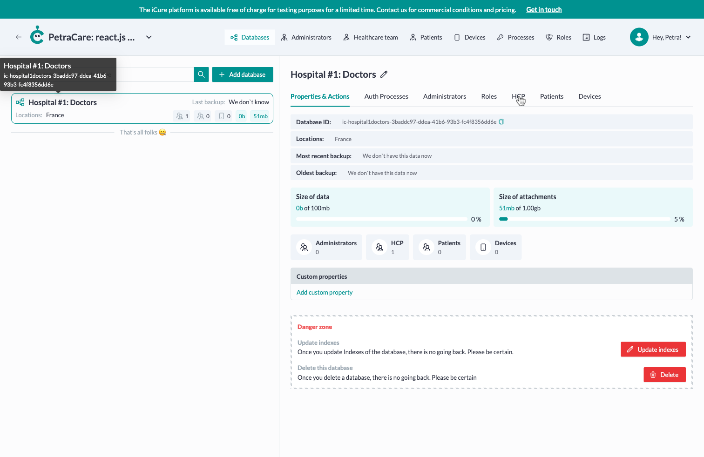
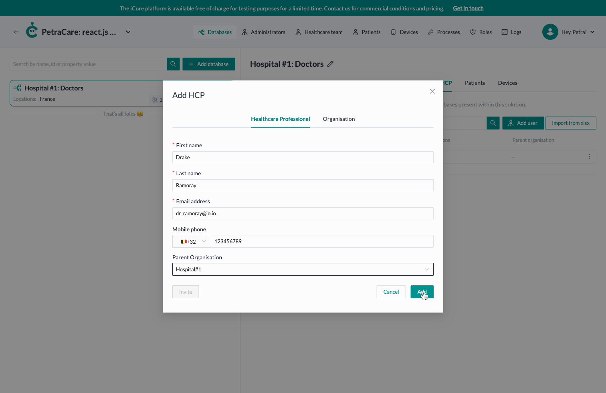
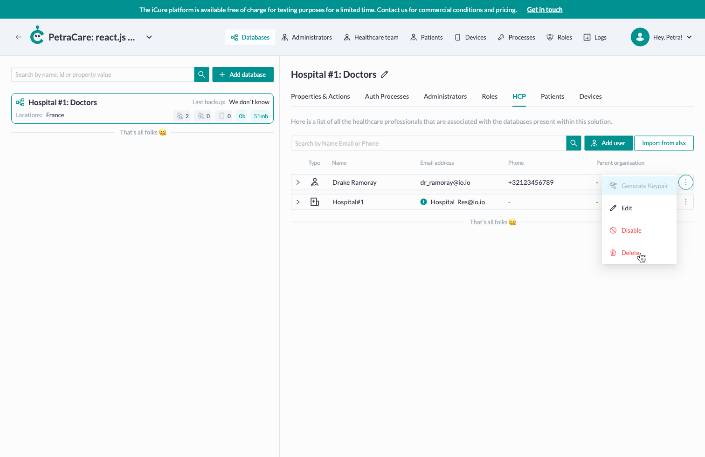
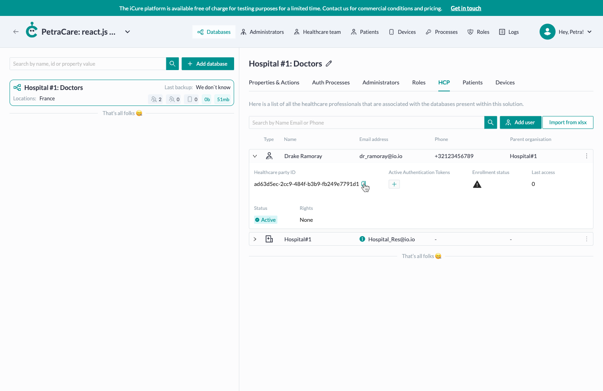
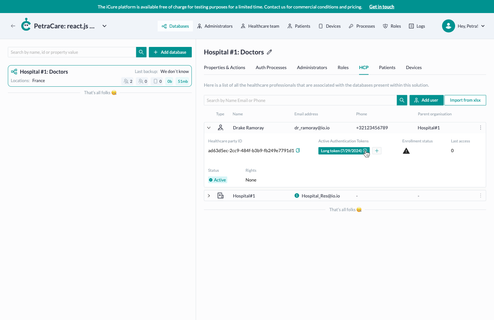
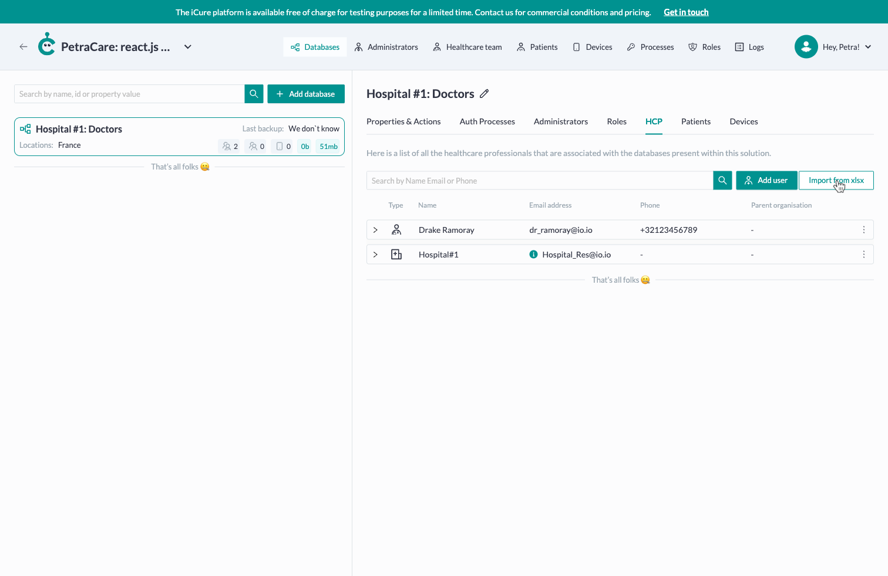

# Handling HCP
HCPs (Healthcare Professionals or Organizations) can be managed within any database. Here are the actions you can perform with HCPs:

## Creating an HCP
#### To create a new HCP, follow these steps:
- Navigate to a solution.
- Choose the relevant database.
- Go to the "HCP" tab.

  

- Click the "Add User" button.

  

- Select the type of HCP you wish to create (Healthcare Professional or Organization).

  

- Fill out the form and save.
- Optionally, send an invitation to the newly created HCP's email.

## Editing an HCP
#### To edit an existing HCP:
- Click the overflow menu button (three dots) next to the HCP.
- Select the "Edit" option.

  

- Make your changes and save.

  

## Deleting an HCP
#### To delete an HCP:
- Click the overflow menu button (three dots) next to the HCP.
- Select the "Delete" option.

  

:::warning
Deletion is permanent and cannot be undone.
:::

## Copying HCP ID
#### To copy an HCP ID:
- Expand the row of the HCP.
- Copy the HCP ID or Organization ID (for organizations).

  

:::info
The HCP ID or Organization ID corresponds to the **PARENT_ORGANISATION_ID** used as an environment variable for configuring your mobile or web application.
:::

## Generating an Authentication Token
#### To generate an authentication token for an HCP:
- Expand the row of the HCP.
- Click the "+" button in the "Active Authentication Tokens" cell.

  

- Enter a unique name and select the expiration date and time.

  

- Copy the token and save it in a secure place, as it will not be retrievable later.

  

- You can delete the token if it is no longer needed.

  

## Importing HCPs from .xlsx
To upload a batch of Healthcare Parties, ensure your table contains the following columns: First Name, Last Name, Email Address, Country Code, Mobile Phone, Parent Organization ID.
:::info
To retrieve the **Parent Organization ID**, navigate to the HCP tab of the particular database, locate and expand the row that corresponds to the desired organization, and copy the Organization ID field.
:::

#### To import HCPs:
- Click the "Import from .xlsx" button.

  

- Upload a file that matches one of the allowed formats: .xlsx, .xls, .xml, .csv, .txt, .ods.

  

- If there are any rejected HCPs, check the reason and fix the problem.
- Click the "Import" button.

:::info
**First Name**, **Last Name**, and **Email Address** fields are required. If any of these required fields are missing, the Healthcare Party will be rejected.
:::
