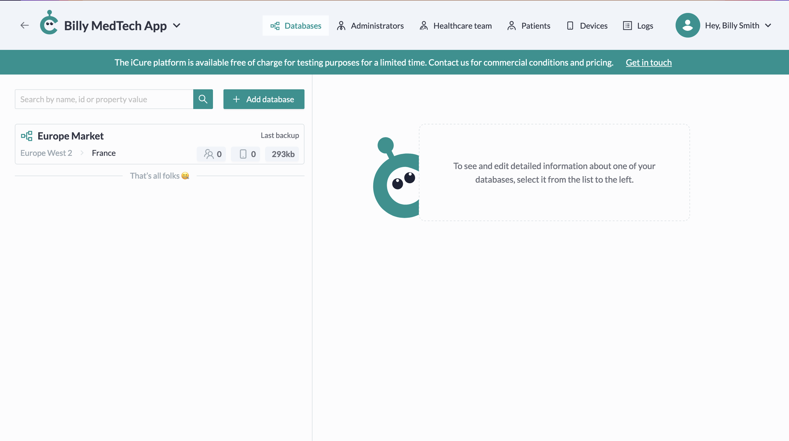

# Quick Start

Welcome to iCure!
In this iCure Quick Start guide, you will learn how to initialize your iCure environment and begin working with the MedTech SDK. The process involves several steps:
- Create your iCure account by registering on the Cockpit Web Portal.
- Create an App, which represents a medical solution or ecosystem, in the Cockpit Dashboard.
- Create a Database within your App to store medical data.
- Choose the CAPTCHA solution you will use and provide your CAPTCHA secret key.
- Create your authentication email and SMS templates and get their ids. 
- (Optional) Create a Parent Healthcare Professional if you need to access patients' medical data.

Before moving on to your dedicated Technology page, ensure that you have completed all the necessary steps. Additional resources and detailed procedures are available throughout the guide for more information.

## Create your iCure account 
Visit our [Cockpit Web Portal](https://cockpit.icure.cloud) and fill in the registration form. 
After providing all the required information, click on **Register**. 

Within a few seconds, you will receive an invitation at the email address you provided in the form. In the email, click on **Verify** to validate your email address and finalize your iCure account creation.

You should now be able to start configuring your own environment:

You can find a detailed procedure to create an account on Cockpit [here](../../cockpit/how-to/how-to-create-your-account). 

## Create an App
On the [Cockpit Dashboard](https://cockpit.icure.cloud/dashboard), click on **Create app**. 
Choose the name of your App, its cluster location, and its spec id. Keep this last piece of information safe, as you will need it in the next steps of this quick start. It will be referenced as the **MSG_GW_SPEC_ID**. 

:::caution
Choose your **MSG_GW_SPEC_ID** carefully before creating your app, as you won't be able to change it later. Be aware that this spec id will prefix the id of your app's databases.
:::

After completing all the required information, click on Create. You now have your first App, and we will need to create a database within it.

### What is an App ? 
In iCure, an **App** represents a **medical solution / eco-system** in which users' medical data are potentially managed through multiple IT services. 

If you would like to learn more about Apps and how to fully manage them, go [here](../../cockpit/how-to/how-to-manage-apps)

## Create a Database
To add medical data to your App, you will need to create a **Database**. 

To do this, click on the App you just created in the [Cockpit Dashboard](https://cockpit.icure.cloud/dashboard). Then, click on **Add database** and fill in all the required information.

When you're ready, click on **Add** to create your first database.

If you would like to learn more about databases and how to fully manage them, go [here](../../cockpit/how-to/how-to-manage-databases).

## Provide your CAPTCHA secret key
**!!!TO DO!!! NOT PART OF COCKPIT YET!!**

## Get your authentication process ids
**!!!TO DO!!! NOT PART OF COCKPIT YET!!**

## Create a parent Healthcare Professional (Optional)
If you don't need your patients' to share medical data with your organisation, you should skip this step.

Using iCure, the patient remains the owner of its medical data. However sometimes, your organisation will need to access them in order to create some additional medical data, derived from the ones of the patient. 
Therefore, you'll need the patient to share some information with you. To do so, you'll need to create a parent healthcare professional representing your organisation, that will be considered as the responsible Healthcare Party of your Patients. 

When configuring the authentication of your users, the id of your parent healthcare professional will be referenced as the **PARENT_HEALTHCARE_PROFESSIONAL_ID**. That way, every new user will automatically share their created medical data with you as well.

:::info
This feature can also be added or removed for existing users. Go and check our dedicated page on [How to share data automatically with other data owners](../how-to/how-to-share-data-automatically.md)
:::

In the Cockpit [Healthcare team panel](https://cockpit.icure.cloud/users), select your database if you haven't done so already, and click on Add user.

Click on the **Organisation** panel and complete the required information for your parent healthcare professional.
Once you're ready, click on **Add**. 

You should now see your newly created healthcare professional. Copy its id and keep it safe, as it will be used in the next steps of the Quick Start. It will be referenced as the **PARENT_HEALTHCARE_PARTY_ID**.

### What is a healthcare professional ? 

A **healthcare professional** is someone who is recognized to provide care or services for a patient. A healthcare professional is either an individual healthcare professional (a doctor, a nurse, a physiotherapist, etc…) or an organization (a clinic, a hospital, a government authority, etc…).

## Generate the cryptographic keys of your Parent Healthcare Professional (Optional)
If you didn't complete the previous step, this one does not apply to you either.

When a patient or a doctor wants to share their medical data with you, they will need to use the public key of your parent healthcare professional. That's why, in order to complete the previous step, you need to generate the cryptographic keys of your parent healthcare professional.

**!!!TO DO!!! NOT PART OF COCKPIT YET!!**

## What's next ?
At the end of this Quick Start, you have successfully set up your iCure environment and are now ready to explore the full potential of the MedTech SDK. 

You can now head to the Technology page concerning you ([React Native](./react-native-quick-start.md), [React JS](./react-js-quick-start.md) or [Node JS](./node-js-quick-start.md)). In those, you will need a few information that we asked you to keep during the previous steps, which were: 
- the **MSG_GW_SPEC_ID**, identifying your App in our Authentication component; 
- the **EMAIL_AUTHENTICATION_PROCESS_ID**, identifying the email template to send to your users during their registration or login;
- the **SMS_AUTHENTICATION_PROCESS_ID**, identifying the SMS template to send to your users during their registration or login;
- the **PARENT_HEALTHCARE_PROFESSIONAL_ID** (optional), identifying your organization as a healthcare professional, to let your users (patients or doctors) share medical data with you automatically. 

