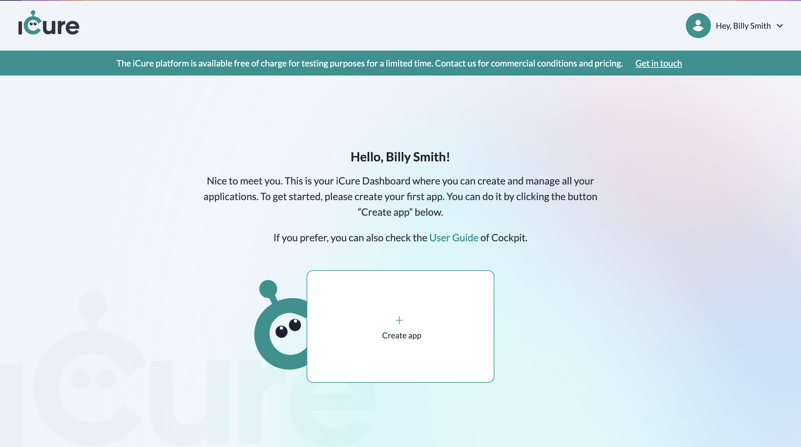
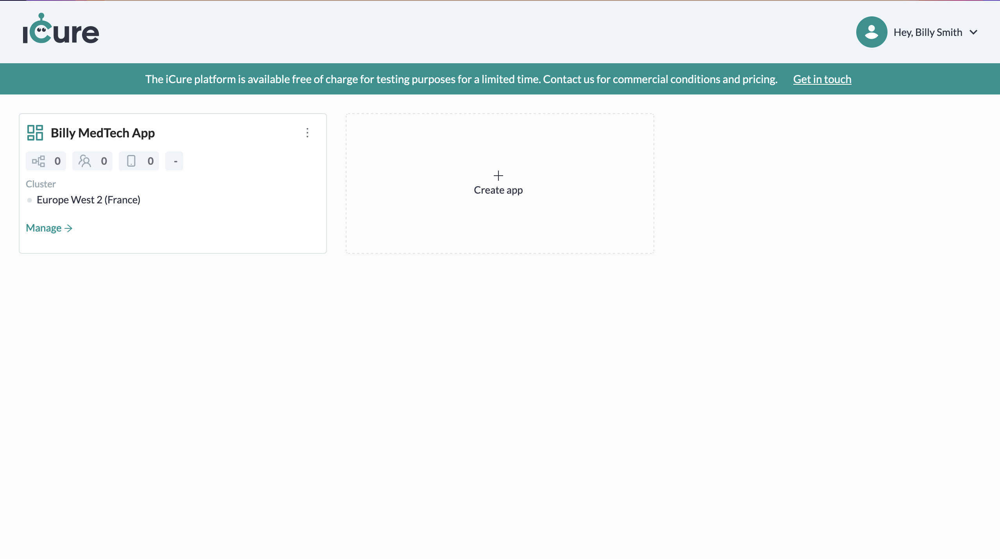

# Quick Start

Welcome to iCure ! In this Quick Start, you will learn how to initialize your iCure environment through **our Cockpit portal** in order to start working with the **MedTech SDK**. 

Your iCure environment ready, you'll afterwards head to the Quick Start child page of your choice, depending on the technologies you will work with. These children pages will help you to start your first project including the iCure MedTech SDK and create your first medical data. 

But first, let's configure your iCure environment ! 

:::caution
Be sure to complete all the steps of this page before heading to your dedicated Technology page. Otherwise, you won't have all the information you need to start creating your medical data with the SDK. 
:::

## Create your iCure account 
Go to our [Cockpit Web Portal](https://cockpit.icure.cloud) and fill in the registration form. 
Once you provided all the mandatory information, click on **Register**. 

In a few seconds, you will receive an invitation to the email address you provided in the form. In the email, click on **Verify** to validate your email address and finalize your iCure account creation.

You should now be able to start configuring your own environment : 

The detailed procedure to create an account on Cockpit can be found [here](../../cockpit/how-to/how-to-create-your-account.md). 

## Create an App
On the [Cockpit Dashboard](https://cockpit.icure.cloud/dashboard), click on **Create app**. 
Choose the name of your App, its cluster location and its spec id. **Keep this last information preciously**, you will need it in the next steps of this quick start. It will be referenced as the **MSG_GW_SPEC_ID**. 

:::caution
Be careful to choose your MSG_GW_SPEC_ID wisely before creating your app: it will prefix the id of your app's databases and you won't be able to change it later
:::

Once you completed all the mandatory information, click on **Create**. You now have your first App and we will need to create a database inside it.

### What is an App ? 
In iCure, an **App** represents a **medical solution / eco-system** in which the medical data of the users are potentially managed through multiple IT services. 

If you would like to know more about what are Apps and how to fully manage them, go [here](../../cockpit/how-to/how-to-manage-apps.md)

## Create a Database
To be able to add medical data in your App, you will have to create a **Database**. 

For this, in the [Cockpit Dashboard](https://cockpit.icure.cloud/dashboard), click on the App you just created. Click afterwards on **Add database** and fill in all the mandatory information. 

Once you're ready, click on **Add** to create your first database. 

If you would like to know more about databases and how to fully manage them, go [here](../../cockpit/how-to/how-to-manage-databases.md).

## Provide your CAPTCHA secret key
**!!!TO DO!!! NOT PART OF COCKPIT YET!!**

## Get your authentication process ids
**!!!TO DO!!! NOT PART OF COCKPIT YET!!**

## Create a Healthcare professional (Optional)
If you have no need to access the medical data of the patients, you should skip this step. 

If you need your users (patients or healthcare professionals) to share their medical data with your company automatically (to compute some new medical data, make diagnosis, ...), you have to create a healthcare professional representing your organization. 

When configuring the authentication of your users, the id of your healthcare professional will be referenced as the **PARENT_HEALTHCARE_PARTY_ID**. That way, every new user will automatically share its created medical data with  you as well. 

:::info
This feature can also be added / removed for existing users. Go and check our dedicated page on [How to share data automatically with other data owners](../how-to/how-to-share-data-automatically.md)
:::

In the Cockpit [Healthcare team panel](https://cockpit.icure.cloud/users), choose your database if not done yet and click on **Add user**. 

Click on **Organisation** panel and complete the mandatory information of your parent healthcare professional. 
Once you're ready, click on **Add**. 

You should now see your newly created healthcare party. Copy its id and keep it preciously, as it will be used in the next steps of the Quick Start. It will be referenced as the **PARENT_HEALTHCARE_PARTY_ID**.

### What is a healthcare professional ? 

A **healthcare professional** is someone who is recognized to provide care or services for a patient. A healthcare professional is either an individual healthcare professional (a doctor, a nurse, a physiotherapist, etc…) or an organization (a clinic, a hospital, a government authority, etc…).

## Generate the cryptographic keys of your Parent Healthcare Professional (Optional)
If you didn't do the previous step, you're not concerned by this one either. 

When a patient or a doctor will want to share his medical data with you, they will need to use the public key of your parent healthcare professional. That's why in order to complete the previous step, you need to generate the cryptographic keys of your parent healthcare professional. 

**!!!TO DO!!! NOT PART OF COCKPIT YET!!**